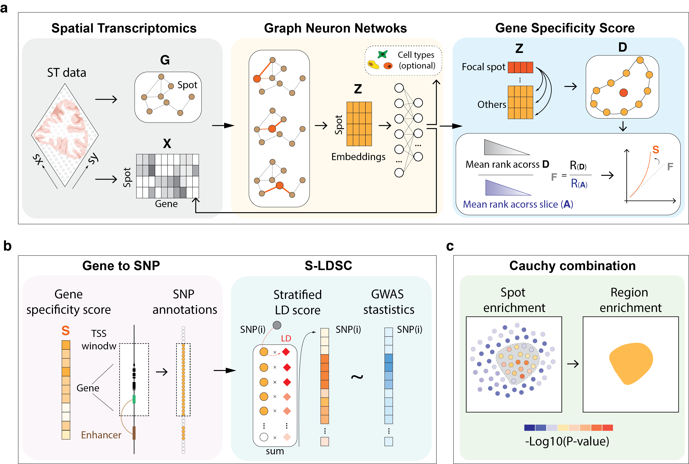

# gsMap (genetically informed spatial mapping of cells for complex traits)
[](https://github.com/LeonSong1995/gsMap/stargazers)
[](https://pypi.org/p/gsMap)
[](https://opensource.org/licenses/MIT)



## 1.Citation
Liyang Song, Wenhao Chen, Junren Hou, Minmin Guo, Jian Yang (2024) Spatially resolved mapping of cells associated with human complex traits (Under review)

## 2.Installation

install use pip:

```bash
pip install gsMap
```

install from source:

```bash
git clone
cd gsMap
pip install -e .
```

## 3.Usage

Please checkout the documentations and tutorials at
[gsMap.docs](https://yanglab.westlake.edu.cn/gsmap/document).


## 4.Online visualization

To visualize the traits-embryo or traits-brain association spatial maps, please refer to [gsmap.visualization](https://yanglab.westlake.edu.cn/gsmap/visualize).

....

---
