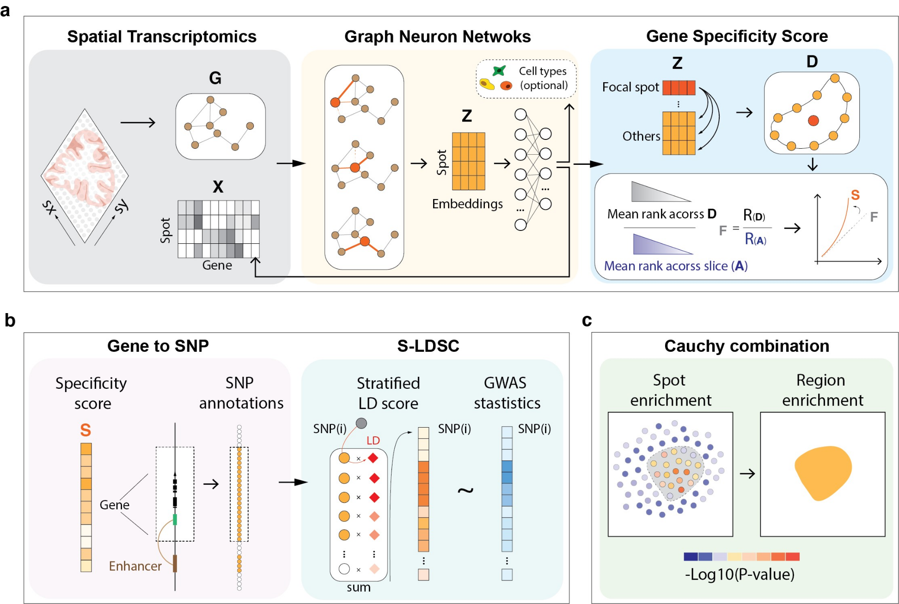

Welcome to GPS's documentation!
===============================

Introduction
------------

``GPS`` (Genetics-informed Pathogenic Spatial Mapping) is an innovative method which integrating genome-wide association studies (GWAS) data with spatial transcriptomics (ST) data, providing insights into the association of cellular spatial heterogeneity with diseases in the context of complex traits.

Key Features
------------

- **GWAS and ST Data Integration**: Combines genetic and spatial gene expression data for comprehensive analysis.
- **Deal with Technical Noise and Sparsity**: Addresses technical noise and gene expression sparsity in ST data by using GNN.
- **High-Resolution Trait Mapping**: Single spot resolution trait mapping, providing insights into the association of cellular spatial heterogeneity with diseases.
- **Therapeutic Potential**: Offers insights into the therapeutic potential of spatial regions by identifying the cell types and genes that are associated with complex traits.

Overview of ``GPS`` Method
--------------------------

``GPS`` operates on a four-step process:

1. **Gene Specificity Assessment in Spatial Contexts**: ``GPS`` begins by addressing technical noise and gene expression sparsity in ST data. It employs graph neuron networks (GNN) to aggregate gene expression information from neighboring spots, thus measuring the gene specificity of individual spots.

2. **Linking SNPs to Gene Specificity**: The method then assigns gene specificity scores to single nucleotide polymorphisms (SNPs), based on their proximity to gene transcription start sites (TSS) and enhancer-gene linking maps. ``GPS`` utilizes stratified LD scores correlated with GWAS summary statistics to establish these associations.

3. **Spatial S-LDSC**: ``GPS`` uses the spatial S-LDSC method to identify spots that are associated with complex traits. This method uses the gene specificity scores of SNPs to calculate the association between individual spots and complex traits.

4. **Spatial Region Significance Test**: Finally, ``GPS`` uses the Cauchy combination test to aggregate P values of individual spots within specific spatial regions. This step is critical in evaluating the association of specific spatial regions with complex traits.

Installation
------------

``GPS`` is available on `GPS GitHub <https://github.com/LeonSong1995/GPS>`__.

How to install ``GPS``, check out the `installation guide <install.rst>`__

Tutorials
---------
How to use ``GPS``, check out the `tutorials <tutorials.rst>`__

Web Application
---------------

You could visit our `GPS website <https://gps.yanglab.westlake.edu.cn/>`__ to see the results of our analysis.

Online Analysis Service
+++++++++++++++++++++++
Please check out our `GPS online application <https://gps.yanglab.westlake.edu.cn/>`__ for a user-friendly online analysis.

User could upload their own GWAS summary statistics data to perform the analysis.

For more details about the ``GPS`` algorithm, please check out our `publication <https://..>`__.

.. toctree::
   :maxdepth: 2
   :caption: Contents:

   install
   tutorials
   data
   release

