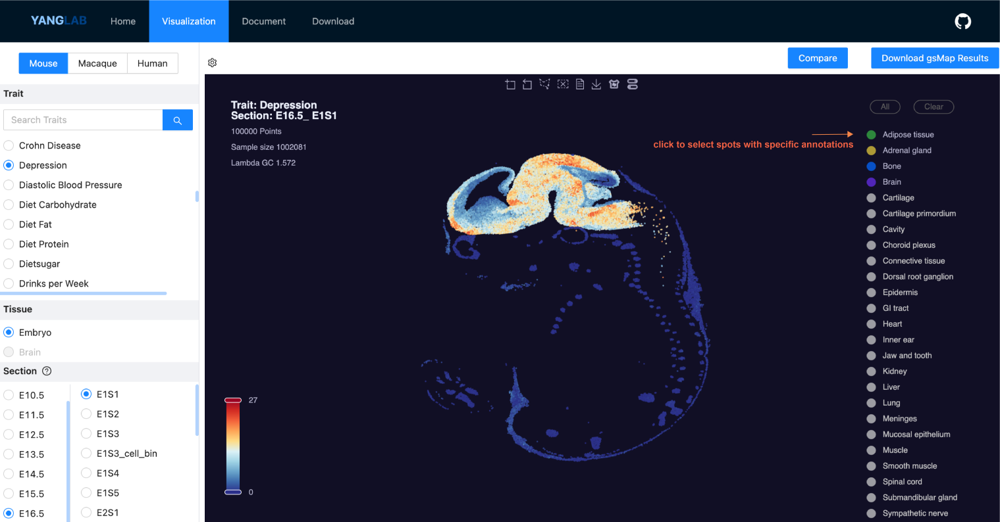
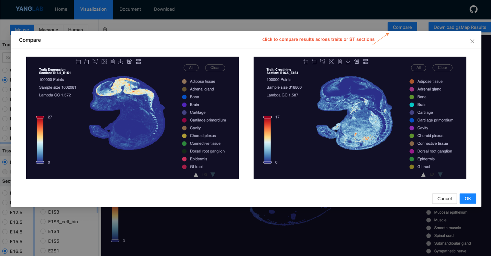

gsMap visualization portal
===================================
We developed gsMap to integrate spatial transcriptomics (ST) data with genome-wide association study (GWAS) summary data, enabling the mapping of spatial distributions of cells associated with human complex traits. gsMap has been applied to ST data from human embryos, mouse embryos, the macaque brain cortex, and 110 GWAS complex traits. To facilitate convenient visualization and re-analysis of our results, we created an online gsMap visualization platform. This documentation guides you on how to utilize the online visualization platform.

Tutorial Video
------------
[here]

How to use the gsMap visualization portal
------------

We provide three ST datasets: human embryo, mouse embryo, and macaque brain cortex. You can select a dataset by clicking on its name.

**Step 1**: Once you have selected an ST dataset, the left navigation bar will display all available traits. Click on a trait's name to select it. Within each ST dataset, there are multiple ST sections; select a section by clicking its name. All results can be downloaded by clicking the `download` button to save both the results and the current figure. On the top left, we provide options to adjust the number and size of spots in ST sections with many spots.

.. image:: _static/raw1_add_txt.svg
   :width: 800
   :alt: Model architecture

|

**Step 2**: After selecting your ST section and traits, the gsMap mapping results will be displayed on the main page. The color represents the significance of the association (−log10 P-value) between the spots and the trait. Hovering over a spot will reveal the specific cell type (or tissue) annotation, spatial coordinates, and association value for that spot. You can adjust the p-value bar to set a threshold and display only the spots that meet the specified significance level.

.. image:: _static/raw2_add_txt.svg
   :width: 800
   :alt: Model architecture

|

**Step 3**: On the right side, you will see the cell type or tissue annotations for this ST dataset. Click the `switch` button to change the spot colors from trait-association significance to spot annotations. Additionally, click the `cell-type` button to select spots belonging to specific annotations. You can select multiple cell types to display results for the annotations you are interested in.

.. image:: _static/raw3_add_txt.svg
   :width: 800
   :alt: Model architecture

|

**Step 4**: To compare gsMap results across different ST sections or traits, click the `compare` button and select the ST sections and traits you wish to compare.

